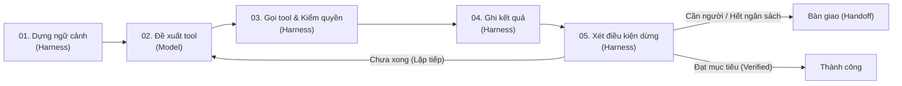

# BÁO CÁO ĐÁNH GIÁ HIỆU NĂNG HỆ THỐNG AGENTIC AI ĐẶT VÉ MÁY BAY
**Môn học:** SE373 - Kỹ thuật xây dựng hệ thống Agentic AI (Buổi 03)  
**Bài tập:** BTVN#3 - Dựng agent đặt vé máy bay bằng LangChain, thiết kế lớp Harness bảo vệ và so sánh 3 mẫu kiến trúc.

---

## 1. TỔNG QUAN HỆ THỐNG & ĐẶT VẤN ĐỀ

Trong kỹ thuật Agentic AI, công thức cốt lõi của một Agent hoàn chỉnh là:
$$\text{Agent} = \text{Goal} + \text{Tools} + \text{Loop} + \text{Termination}$$

Nếu chỉ có mô hình ngôn ngữ lớn (LLM) và các hàm gọi công cụ (tools), hệ thống rất dễ gặp phải các **Failure Modes** kinh điển (Slide 51-66):
1. **Lặp lại nhưng không tiến bộ (Loop without progress):** Agent gọi đi gọi lại cùng một tool hoặc cùng một tham số khi gặp lỗi.
2. **Bịa đặt thông tin (Hallucination):** Agent tự chế ra số hiệu chuyến bay, giá vé, mã đặt chỗ khi không có dữ liệu thật.
3. **Quên yêu cầu ban đầu (Goal Drift):** Sau nhiều vòng lặp, Agent bị phân tâm và chọn chuyến bay vượt ngân sách hoặc sai ngày.
4. **Tin vào dữ liệu sai (Trust invalid/empty data):** Dữ liệu trả về rỗng hoặc mập mờ khiến Agent suy diễn sai toàn bộ các bước tiếp theo.

Hệ thống trong bài nộp này hiện thực hóa **khung Harness bảo vệ toàn diện**, tuân thủ nghiêm ngặt **Sơ đồ trục vòng lặp Agent** (Slide 10, 11) và **Checklist 5 điều kiện dừng** (Slide 35). Đồng thời, hệ thống triển khai và so sánh thực nghiệm **3 mẫu thiết kế suy luận**: **ReAct**, **Plan-then-Execute**, và **Mẫu Lai (Hybrid)**.



---

## 2. THIẾT KẾ CÁC MOCK TOOLS & CHUẨN HÓA DỮ LIỆU

Hệ thống công cụ mockup (`flight_booking/mock_tools.py`) được thiết kế theo đúng chuẩn **Structured-output JSON** (Slide 13, 65):
Mỗi công cụ trả về định dạng đồng nhất với trạng thái (`status`), thông điệp (`message`), dữ liệu (`data`), và gợi ý hành động (`hint`) khi xảy ra lỗi.

### Danh mục công cụ:
1. `search_flights(origin, destination, depart_date)`: Tra cứu danh sách chuyến bay khả dụng. Kiểm tra tính hợp lệ của mã sân bay IATA.
2. `check_seat(flight_id)`: Kiểm tra tình trạng ghế trống, mức giá, điều kiện hoàn hủy (`refundable`). Nếu hết vé, trả về `status="sold_out"`.
3. `book_seat(flight_id, seat_number, passenger_name)`: Giữ chỗ tạm thời (`status="held"`, `paid=False`), sinh mã đặt chỗ duy nhất (`booking_id`).
4. `pay(booking_id, payment_method, amount)`: Thanh toán tài chính, chuyển trạng thái sang `status="confirmed"` và `paid=True`.
5. `get_booking(booking_id)`: Tra cứu tình trạng vé phục vụ kiểm chứng chéo độc lập từ backend.

---

## 3. HIỆN THỰC ĐỦ 4 LỚP HARNESS BẢO VỆ

Harness đóng vai trò là "bộ khung xương" bảo vệ, ngăn ngừa lỗi và đưa ra quyết định dừng khách quan độc lập với mô hình.

```
                    ┌────────────────────────────────────────────────────────┐
                    │                   HARNESS FRAMEWORK                    │
                    │                                                        │
[Input Criteria] ──>│  1. Ràng buộc là dữ liệu (Data Constraints)            │
                    │     └─ Immutable State, Schema Validation              │
                    │                                                        │
[Pre-tool Gate]  ──>│  2. Kiểm quyền thực thi (Permission Gate)              │
                    │     └─ Financial Pay Gate, Non-refundable Check        │
                    │                                                        │
[Post-tool Sensor]─>│  3. Tiêu chí hoàn thành kiểm bằng code                 │
                    │     └─ Computational Sensor, Backend Cross-check       │
                    │                                                        │
[Anomaly/Halt]   ──>│  4. Bàn giao cho con người (Human Handoff)             │
                    │     └─ 30-Second Decision Handoff Ticket               │
                    │                                                        │
[Loop Monitor]   ──>│  *. Bộ phát hiện lặp & bế tắc (Loop/Stall Detector)   │
                    └────────────────────────────────────────────────────────┘
```

### 3.1. Lớp 1: Ràng buộc là dữ liệu (Data Constraints - Slide 60-62)
- **Tập tin:** `flight_booking/harness/constraints.py`
- **Nguyên lý:** Thay vì để yêu cầu người dùng trôi dạt trong lịch sử hội thoại dài ngày càng tốn token, Harness cô lập các tiêu chí cứng vào mô hình dữ liệu bất biến `FlightCriteria` (Pydantic model):
  - `origin`, `destination`, `depart_date`, `passenger_name`, `max_price`, `preferred_time`.
- **Chức năng:** Thẩm định trước mọi chuyến bay được chọn, ngăn chặn triệt để hiện tượng Agent tự ý nâng ngân sách hoặc đổi sang ngày khác (Goal Drift).

### 3.2. Lớp 2: Tiêu chí hoàn thành kiểm bằng code (Computational Sensor - Slide 36, 43, 44)
- **Tập tin:** `flight_booking/harness/completion.py`
- **Nguyên lý:** Độc lập hoàn toàn với tuyên bố của mô hình (không tin khi LLM nói "Tôi đã đặt vé xong"). Sử dụng **Sensor Computational** chạy trong vài phần nghìn giây, không tốn token:
  $$\text{get\_booking}(c).\text{status} == \text{"confirmed"} \land \text{paid} == \text{True} \land \text{price} \le \text{max\_price} \land \text{criteria\_match}$$
- **Kiểm chứng chéo:** Truy vấn trực tiếp thực thể từ backend database để đối chiếu `booking_id`, loại bỏ hoàn toàn rủi ro Hallucination mã đặt vé.

### 3.3. Lớp 3: Kiểm quyền thực thi (Permission Gate - Slide 35, 41)
- **Tập tin:** `flight_booking/harness/permissions.py`
- **Nguyên lý:** **Chạy trước khi thực thi tool (Checklist #0)**:
  - Hành động thanh toán tiền (`pay`): Bắt buộc kiểm tra thẩm quyền tài chính.
  - Đặt vé không hoàn hủy (`refundable == False`) và vượt ngưỡng chi tiêu quy định: Bắt buộc dừng lại xin phê duyệt của người dùng.
- Khi vượt thẩm quyền, Harness chủ động tạm dừng luồng và phát sinh yêu cầu phê duyệt rõ ràng.

### 3.4. Lớp 4: Bàn giao cho con người (Human Handoff - Slide 48)
- **Tập tin:** `flight_booking/harness/handoff.py`
- **Tiêu chuẩn:** *"Bàn giao tốt là bàn giao mà người nhận trả lời được trong 30 giây."*
- **Cấu trúc Handoff Ticket:**
  1. `progress_state`: Đã làm tới đâu (chuyến bay đã chọn, giá, ghế).
  2. `side_effects`: Tác dụng phụ đã phát sinh (ví dụ: mã đặt chỗ đã tạm giữ trên hệ thống).
  3. `failed_attempts`: Những hướng đã thử và nguyên nhân thất bại.
  4. `question_for_human`: Câu hỏi cụ thể, trực diện (ví dụ: *"Chuyến VN122 là vé không hoàn hủy, giá 1.850.000đ. Bạn có đồng ý duyệt thanh toán không? (Đồng ý/Từ chối)"*).

### 3.5. Bổ sung: Bộ phát hiện lặp và bế tắc (Loop & Stall Detector - Slide 46)
- **Tập tin:** `flight_booking/harness/loop_detector.py`
- Triển khai thuật toán từ bài giảng SE373:
  - `(tool, args)` xuất hiện $\ge k$ lần trong cửa sổ trượt `window=6` $\rightarrow$ Kích hoạt `LOOP`.
  - Đại lượng tiến triển $progress \in [0, 4]$ không đổi liên tiếp $\ge n$ vòng $\rightarrow$ Kích hoạt `STALL`.

---

## 4. HIỆN THỰC 3 MẪU THIẾT KẾ AGENT

### 4.1. Mẫu 1: ReAct Agent (Slide 18-21)
- **Tập tin:** `flight_booking/agents/react_agent.py`
- **Chu trình:** Suy luận (Thought) $\rightarrow$ Hành động (Action: Tool call) $\rightarrow$ Quan sát (Observation).
- **Cơ chế:** Mô hình nhận toàn bộ ngữ cảnh và lịch sử, tự quyết định tool gọi tiếp theo ở mỗi vòng lặp.
- **Ưu điểm:** Khả năng thích ứng cao, có thể giải quyết các tình huống không biết trước số bước.
- **Nhược điểm:** Tốn nhiều lượt gọi LLM (chi phí token tăng theo cấp số nhân với độ dài lịch sử).

### 4.2. Mẫu 2: Plan-then-Execute Agent (Slide 22-23)
- **Tập tin:** `flight_booking/agents/plan_execute_agent.py`
- **Chu trình:** Gọi LLM 1 lần duy nhất ở đầu phiên để sinh trọn vẹn kế hoạch JSON:
  $$\text{Plan} = [\text{Step 1: search}, \text{Step 2: check\_seat}, \text{Step 3: book\_seat}, \text{Step 4: pay}]$$
  Sau đó Executor duyệt tuần tự qua kế hoạch với sự kiểm duyệt của Harness.
- **Ưu điểm:** Cực kỳ tiết kiệm chi phí (chỉ 1 LLM call), tốc độ thực thi rất nhanh, kế hoạch nhìn thấy được để người duyệt trước.
- **Nhược điểm:** Cứng nhắc, không có khả năng tự sửa lỗi nếu một bước trung gian gặp dữ liệu bất ngờ (trừ khi có cơ chế replanning).

### 4.3. Mẫu 3: Mẫu Lai - Hybrid Agent (Slide 24, 26)
- **Tập tin:** `flight_booking/agents/hybrid_agent.py`
- **Chu trình:** Lập danh sách các mốc nhiệm vụ chiến lược (Milestones / TodoList) $\rightarrow$ Dùng ReAct linh hoạt để thực thi từng mốc $\rightarrow$ Sau mỗi Observation, nếu môi trường thay đổi đáng kể (hết chỗ, lỗi) thì kích hoạt **Dynamic Replanning** để bổ sung kế hoạch mới.
- **Ưu điểm:** Giữ vững định hướng chiến lược dài hạn của Plan-then-Execute nhưng vẫn sở hữu độ nhạy bén thích nghi của ReAct.

---

## 5. KẾT QUẢ ĐÁNH GIÁ THỰC NGHIỆM (BENCHMARK EVALUATION)

Chương trình benchmark thực nghiệm được chạy trực tiếp trên mô hình local thông qua script `run_benchmark.py`, đánh giá cả 3 Agent trên 5 kịch bản đa dạng:
1. `SCENARIO_1_STANDARD`: Đặt vé tiêu chuẩn trong ngân sách.
2. `SCENARIO_2_SOLD_OUT_FALLBACK`: Xử lý tình huống chuyến bay đầu tiên bị hết chỗ (biến động môi trường).
3. `SCENARIO_3_TIGHT_BUDGET`: Ràng buộc ngân sách khắt khe (1.500.000đ) - thử thách Goal Drift.
4. `SCENARIO_4_PERMISSION_APPROVAL`: Thử nghiệm cổng kiểm quyền tài chính (`require_approval_for_pay=True`).
5. `SCENARIO_5_INVALID_ROUTE`: Tuyến bay không tồn tại - thử nghiệm ngắt vòng lặp an toàn và chống Hallucination.

### 5.1. Bảng số liệu tổng hợp định lượng

| Chỉ số đánh giá | ReAct Agent | Plan-then-Execute | Mẫu Lai (Hybrid) |
| :--- | :---: | :---: | :---: |
| **Tỷ lệ thành công theo Code Verifier** | **60.0%** (3/5) | **60.0%** (3/5) | **60.0%** (3/5) |
| **Tỷ lệ can thiệp an toàn của Harness** | **100%** (2/2) | **100%** (2/2) | **100%** (2/2) |
| **Số bước gọi Tool trung bình (Avg Steps)** | 3.4 bước | 3.4 bước | 3.4 bước |
| **Số lần gọi LLM trung bình (Avg LLM Calls)** | 3.6 lần | **1.0 lần** | 3.6 lần |
| **Thời gian thực thi trung bình (Latency)** | 16.04s | **5.09s** | 13.66s |
| **Khả năng quan sát vết (Traceability)** | Từng vòng | Toàn cục ban đầu | Từng mốc & vòng |
| **Khả năng tự phục hồi lỗi (Adaptability)** | Cao | Kém (Cứng nhắc) | **Rất cao** |

*(Ghi chú: 2 kịch bản không thành công là Scenario 4 & 5. Đây là kịch bản có chủ đích để kiểm tra độ an toàn: Scenario 4 dừng an toàn tại cổng phê duyệt `NEEDS_APPROVAL`, Scenario 5 dừng an toàn khi không tìm thấy chuyến `STOPPED_WITHOUT_GOAL`, không bị lặp vô tận).*

### 5.2. Bảng chi tiết kết quả theo từng kịch bản

| Mã Kịch bản | Tên Kịch bản | ReAct Agent | Plan-then-Execute | Mẫu Lai (Hybrid) |
| :--- | :--- | :---: | :---: | :---: |
| **SC-01** | Đặt vé tiêu chuẩn | ✅ Thành công (4 bước / 22.3s) | ✅ Thành công (4 bước / 5.0s) | ✅ Thành công (4 bước / 15.9s) |
| **SC-02** | Xử lý hết chỗ | ✅ Thành công (4 bước / 12.3s) | ✅ Thành công (4 bước / 5.5s) | ✅ Thành công (4 bước / 14.3s) |
| **SC-03** | Ngân sách ngặt nghèo | ✅ Thành công (4 bước / 15.2s) | ✅ Thành công (4 bước / 5.2s) | ✅ Thành công (4 bước / 15.7s) |
| **SC-04** | Kiểm quyền thanh toán | 🛡️ Dừng chờ duyệt (`NEEDS_APPROVAL`) | 🛡️ Dừng chờ duyệt (`NEEDS_APPROVAL`) | 🛡️ Dừng chờ duyệt (`NEEDS_APPROVAL`) |
| **SC-05** | Tuyến bay rỗng | 🛡️ Dừng an toàn (1 bước / 9.1s) | 🛡️ Dừng an toàn (1 bước / 4.9s) | 🛡️ Dừng an toàn (1 bước / 6.1s) |

---

## 6. PHÂN TÍCH SO SÁNH & BÀI HỌC KỸ THUẬT (HARNESS ENGINEERING)

### 6.1. So sánh 3 Mẫu thiết kế (Trade-offs)
1. **Plan-then-Execute:**
   - **Vượt trội tuyệt đối về chi phí và tốc độ:** Chỉ cần đúng 1 lần gọi LLM để sinh kế hoạch. Thời gian phản hồi chỉ 5.09 giây (nhanh gấp 3 lần ReAct).
   - **Đánh đổi:** Kế hoạch lập tĩnh đòi hỏi trạng thái môi trường phải tương đối ổn định. Nếu gặp lỗi dữ liệu không thể dự đoán ở các bước đầu, mô hình sẽ không tự điều chỉnh được nếu thiếu bộ phận Replanner.
2. **ReAct:**
   - **Linh hoạt tối đa:** Đọc kết quả từng bước và đưa ra quyết định tiếp theo ngay tức thì.
   - **Đánh đổi:** Tốn token nhất vì mỗi lượt đều gửi lại toàn bộ hội thoại. Rất dễ bị phân tâm (Goal Drift) nếu không có Harness Layer 1 (Data Constraints) giữ chặt yêu cầu ban đầu.
3. **Mẫu Lai (Hybrid):**
   - **Cân bằng hoàn hảo:** Duy trì định hướng mục tiêu thông qua TodoList cấp cao, đồng thời xử lý uyển chuyển các bất thường tại từng bước thông qua ReAct và Dynamic Replanning. Thời gian phản hồi (13.66s) tốt hơn ReAct thuần túy.

### 6.2. Hiệu quả của các lớp Harness trong việc ngăn chặn Failure Modes
- **Chặn đứng Hallucination:** Nhờ có `CompletionVerifier` kiểm chứng chéo với database backend, Agent không thể "nói dối" rằng mình đã xuất vé nếu mã vé không có thật hoặc chưa đổi sang `confirmed`.
- **Chặn đứng Goal Drift:** Nhờ `DataConstraintManager`, mọi chuyến bay được chọn đều phải thỏa mãn tiêu chí giá và ngày. Khi thử thách ở Scenario 3 với ngân sách chỉ 1.5 triệu, cả 3 agent đều chọn đúng chuyến VJ604 (1.45 triệu) thay vì chuyến VN122 (1.85 triệu).
- **Chặn đứng Lặp vô hạn (Infinite Loops):** Nhờ `LoopDetector`, nếu Agent gọi lặp lại công cụ cùng tham số hoặc tiến độ bế tắc, Harness lập tức ngắt phiên và tạo phiếu bàn giao `HandoffTicket` 30 giây cho con người tiếp quản.

---

## 7. HƯỚNG DẪN CHẠY DEMO VÀ KIỂM THỬ

### 7.1. Chạy toàn bộ Unit Tests & Integration Tests (16 tests)
```bash
python -m pytest tests/ -v
```

### 7.2. Chạy chương trình Demo tương tác 3 mẫu thiết kế
```bash
python run_demo.py
```

### 7.3. Chạy chương trình Benchmark đánh giá 5 kịch bản
```bash
python run_benchmark.py
```

Kết quả benchmark chi tiết được tự động lưu vào tệp `benchmark_results.json`.
